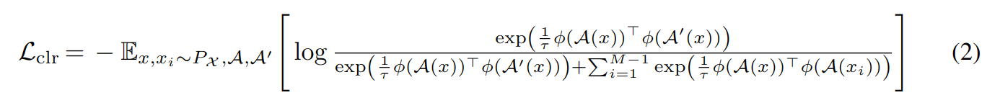
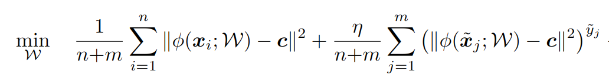
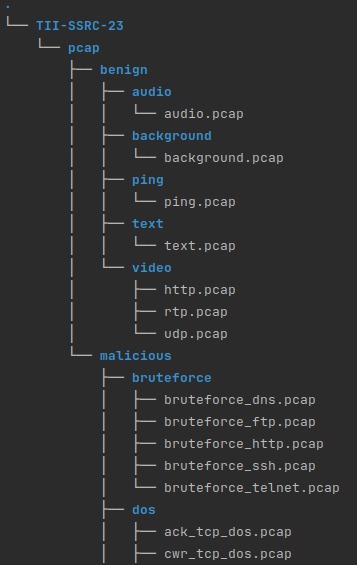

# Lightweight Deep Anomaly Detection for Network Traffic

LDPI is a plugin within the Comm. Sleeve's mesh_com [repository](https://github.com/tiiuae/mesh_com). It monitors network interfaces to identify deviations from expected traffic patterns using unsupervised and semi-supervised learning approaches. The system primarily relies on normal traffic data for training, though incorporating additional malicious samples is optional and can enhance the method's effectiveness.

This toolkit includes all necessary components for real-time traffic analysis, from data quantization to training scripts for custom dataset adaptation. It analyzes the initial packets of network flows using their 5-tuple identifiers and inputs the raw packet data into a deep learning model. Our default setup uses 1D convolutions, but the architecture is designed to be flexible, allowing the use of various encoders such as RNNs or transformers. It employs a compact ResNet model to accommodate resource-constrained environments. However, the encoder's capacity can be expanded to suit environments with more computational resources.

## Pretraining and Training

Pretraining involves contrastive learning with outlier exposure through distribution augmentation, utilizing only normal data. The following contrastive loss [1] is applied during pretraining:

Subsequently, the projection head is dropped/replaced, and the model is fine-tuned using the Deep SAD loss [2]:

Once training is completed, several thresholds are computed, such as the 99th percentile and maximum. The threshold used during inference is configurable based on these thresholds. 
 

## Training On Your Dataset

You can adapt the model to your network environment by retraining it with your data. Delete all models within the `ldpi/training/output/` folder. Note: Deleting `pretrained_model.pth` is optional. Place your `.pcap` files, representing both normal and attack data (if available), in the `datasets` folder. To ensure compatibility, your dataset should adhere to the structure outlined below (refer to **Dataset Structure**).
 
Training involves three main steps:

1. **Data Preparation**: Place your benign and malicious datasets in the `datasets/` directory, structured as mentioned above.

2. **Preprocessing**: Run `ldpi/training/preprocessing.py` to preprocess your network data for training.

3. **Model Training**: Execute `ldpi/training/training.py` in the same directory to train the model using the preprocessed data.

### Dataset Structure

Your custom dataset should comply with the following strcuture within `ids-ldpi/datasets/`

## References

[1] Learning and Evaluating Representations for Deep One-class Classification

[2] Deep Semi-Supervised Anomaly Detection

